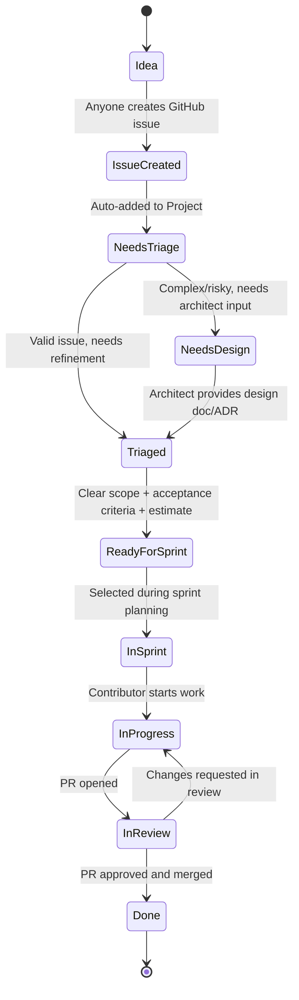

# Contributing to DiracGrid

Thank you for your interest in contributing to DIRAC-related projects! This document outlines the workflow and guidelines for contributing to our projects.

## Table of Contents

- [Issue Workflow](#issue-workflow)
- [Creating Issues](#creating-issues)
- [Labels and Organization](#labels-and-organization)
- [Development Process](#development-process)
- [Pull Request Process](#pull-request-process)
- [For Maintainers](#for-maintainers)

## Issue Workflow

Our issue workflow follows a structured process from idea to completion using GitHub Projects:



### Workflow States

**Note**: We use GitHub Projects to manage workflow. Issues are tracked through Project Status fields, not labels.

#### 1. **Idea → Issue Created**
Anyone can create a GitHub issue using our issue templates:
- **Bug Report**: For reporting bugs or unexpected behavior
- **Feature Request**: For suggesting new features or enhancements

#### 2. **Needs Triage** (Project Status)
- New issues are automatically added to the Project with Status = "Needs triage"
- Maintainers review the issue to:
  - Confirm it's valid and not a duplicate
  - Set appropriate fields:
    - **Area** (epic): pilot, core, wf-mgmt, data-mgmt, resource-mgmt, deployment, obs-analytics, ui
    - **Priority** label: priority:critical, priority:high, priority:medium, priority:low
    - **Type** label: bug, enhancement, documentation, question
  - Determine if it needs design work or can go to backlog

#### 3. **Needs Design** (Project Status)
- Applied to complex or risky issues that require architectural input
- An architect or senior developer will:
  - Create a design document or Architecture Decision Record (ADR)
  - Outline the technical approach
  - Identify potential risks or trade-offs
- Once design is complete, status moves to "Triaged"

#### 4. **Triaged** (Project Status)
- Issue is valid and understood but needs refinement
- During refinement/grooming:
  - Add clear acceptance criteria
  - Add story point estimate using the **Story Points** field
  - Clarify any open questions
- Once refined, status moves to "Ready for sprint"

#### 5. **Ready for Sprint** (Project Status)
- Issue has clear scope, acceptance criteria, and story point estimate
- Ready to be selected during sprint planning
- Only maintainers can move issues to this status

#### 6. **In Sprint** (Project Status)
- Issue is assigned to a specific sprint using the **Sprint** field
- Selected during sprint planning meeting
- Developer may be assigned at this stage

#### 7. **In Progress** (Project Status)
- Developer has started work on the issue
- Typically indicated by an open PR or assignment to a developer
- Issue should be linked to the PR

#### 8. **In Review** (Project Status)
- Pull request has been opened
- Awaiting code review from maintainers
- May loop back to "In Progress" if changes are requested

#### 9. **Done** (Project Status)
- PR has been approved and merged
- Issue is automatically closed (if properly linked in PR)

## Creating Issues

### Bug Reports

When creating a bug report, please include:
- **Clear description** of the bug
- **Confirmation** that you've searched for duplicates
- **Steps to reproduce** the issue
- **Expected vs. actual behavior**
- **Environment details** (OS, version, etc.)
- **Log output** if available

### Feature Requests

When requesting a feature, please provide:
- **User story** format (As a [user], I want [goal], so that [benefit])
- **Description** of the proposed feature
- **Definition of Done** - what criteria must be met?
- **Related or blocking issues**

## Development Process

### 1. Fork and Clone

For external contributors:
```bash
# Fork the repository on GitHub, then clone your fork
git clone https://github.com/YOUR-USERNAME/REPO-NAME.git
cd REPO-NAME
git remote add upstream https://github.com/DiracGrid/REPO-NAME.git
```

### 2. Create a Branch

```bash
git checkout -b feat_descriptive-name
# or
git checkout -b fix_bug-description
```

### 3. Make Changes

- Write clean, maintainable code
- Follow the project's coding standards
- Add tests for new functionality
- Update documentation as needed

### 4. Commit Your Changes

```bash
git add .
git commit -m "fix: brief description of changes"
```

Ideally, follow conventional commit format:
- `feat:` - New feature
- `fix:` - Bug fix
- `docs:` - Documentation changes
- `test:` - Test additions or changes
- `refactor:` - Code refactoring
- `chore:` - Maintenance tasks

### 5. Keep Your Branch Updated

```bash
git fetch upstream
git rebase upstream/main
```

## Pull Request Process

### 1. Push Your Changes

```bash
git push origin your-branch-name
```

### 2. Open a Pull Request

- Go to the repository on GitHub
- Click "New Pull Request"
- Select your branch
- Fill out the PR template with:
  - Summary of changes
  - Link to related issue(s)
  - Testing performed

### 3. Code Review

- Address reviewer feedback promptly
- Make requested changes in new commits
- Push updates to your branch
- The PR will automatically update

### 4. Merge

- Once approved, a maintainer will merge your PR
- The related issue will automatically close (if properly linked)
- Your branch can be deleted after merge

## Best Practices

### Code Quality

- Write self-documenting code with clear variable/function names
- Add comments where logic is complex or non-obvious
- Keep functions small and focused on a single responsibility
- Write unit tests for new functionality

### Communication

- Be respectful and constructive in all interactions
- Ask questions if requirements are unclear
- Keep issue discussions focused and on-topic
- Update issues if you encounter blockers or need help

### Issue Management

- Link PRs to issues using keywords (`Closes #456`)
- Assign yourself to an issue if you start working on it
- If you can't complete an issue, unassign yourself and comment

## Getting Help

- **Questions**: Open a discussion
- **Documentation**: Check the repository's README, [DIRAC documentation](https://dirac.diracgrid.org/en/latest/) and [DiracX documentation](https://diracx.diracgrid.org/)
- **Community**: Join our community channels

Thank you for contributing!
